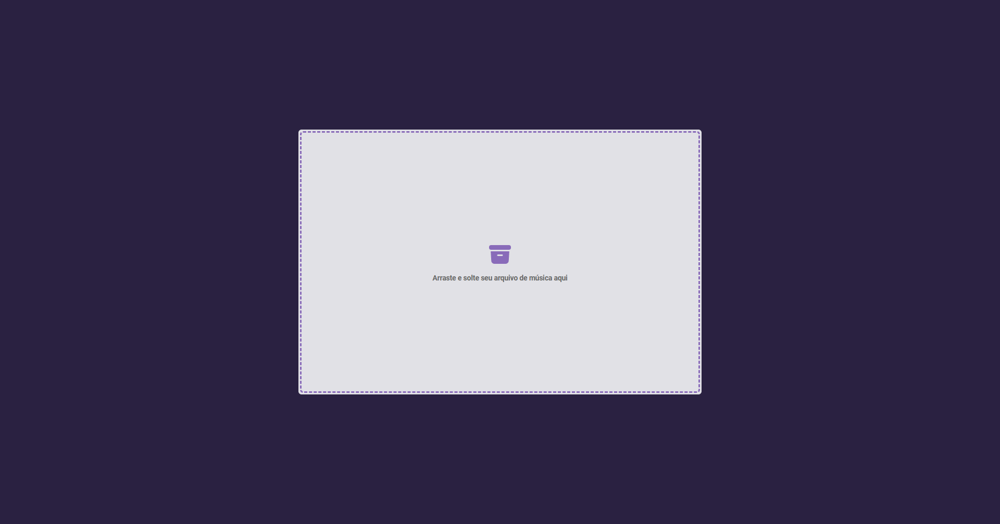
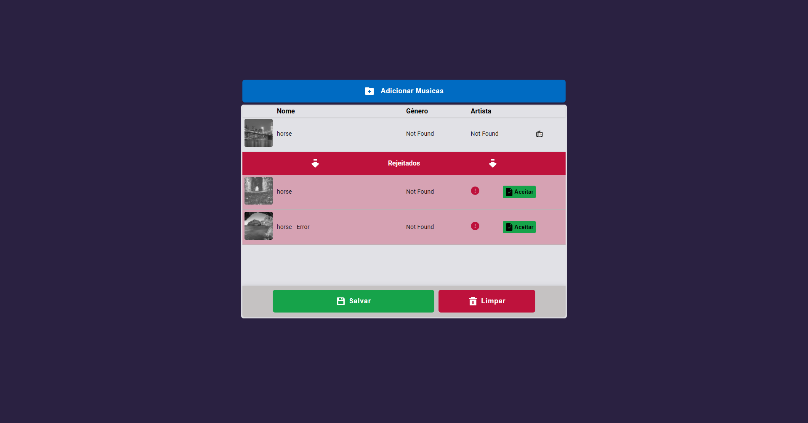
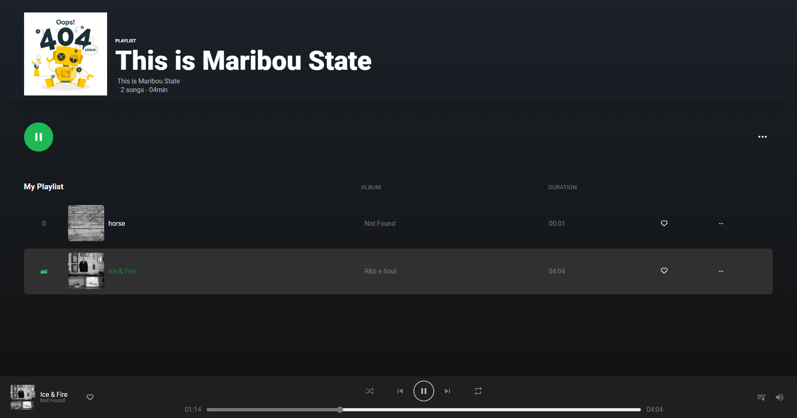
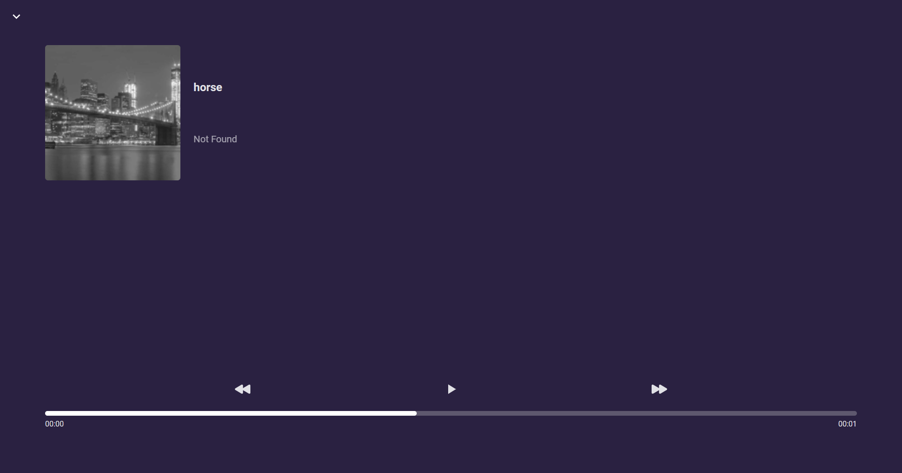

<h1 align="center">Jukebox</h1>

  

<!--  -->
</img>
</img> 
</img>
</img> 

> ##### **Obs: Imagens do mobile [IMG1](./AppShowcase/capturezone_mobile.png) [IMG2](./AppShowcase/selectionzone_mobile.png) [IMG3](./AppShowcase/playlist_mobile.png) [IMG4](./AppShowcase/player_mobile.png)**
 

## 💻 Projeto

A <b>Jukebox</b> e um website que disponibiliza meios par você reproduzir suas músicas com a lista de suas músicas com informações e um player completo para reproduzi-las.

## ✨ Tecnologias

Esse projeto foi desenvolvido com as seguintes tecnologias:

- [React](https://reactjs.org/)
- [CSS](https://developer.mozilla.org/pt-BR/docs/Web/CSS)
- [HTML](https://developer.mozilla.org/pt-BR/docs/Web/HTML)
- [TypeScript](https://www.typescriptlang.org/)
- [JsMediatags](https://github.com/aadsm/jsmediatags)
- [React Icons](https://react-icons.github.io/react-icons/)
- [React Dropzone](https://react-dropzone.js.org/)

## 🚀 Como executar

- Clone o repositório
- Rode `npm install` para instalar as dependências
- Rode o `npm start` para iniciar a aplicação na porta <b>3000</b>
- Por fim, a aplicação estará disponível em `http://localhost:3000`

## 📄 Licença

Esse projeto está sob a licença MIT. Veja o arquivo [LICENSE](LICENSE) para mais detalhes.